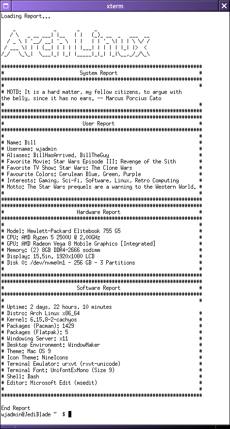

# sysreport
A System/User report tool written in pure bash.

## Requirements
This script requires [FIGlet](http://www.figlet.org/) and [fortune](https://github.com/shlomif/fortune-mod) for the ASCII art text and MOTD.

## Package Manager Suggestions
If you have a suggestion for a package manager to add to the number of packages section, make an issue with the correct synatx for listing all packages, remove any unnecessary lines, and piped into `wc -l`.
